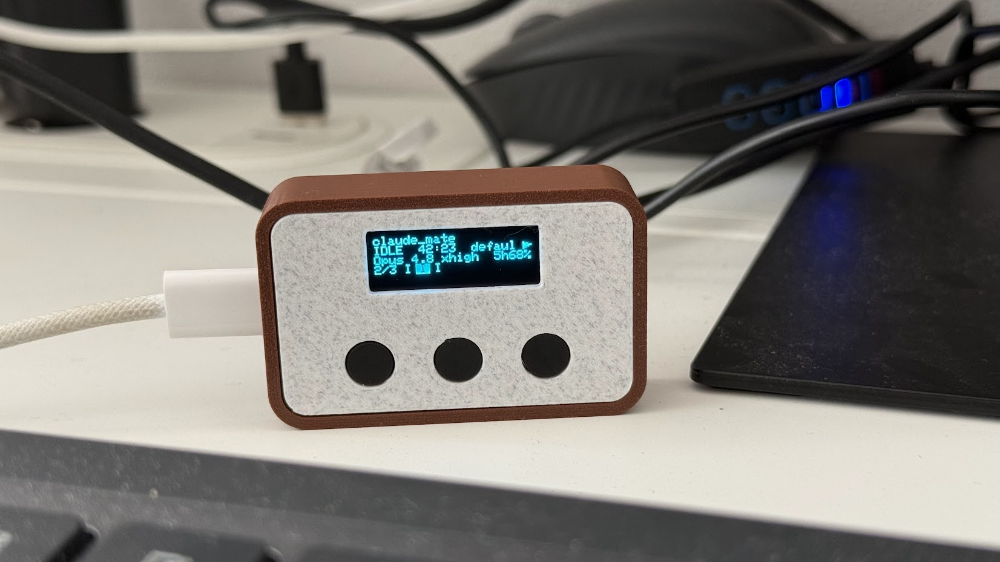
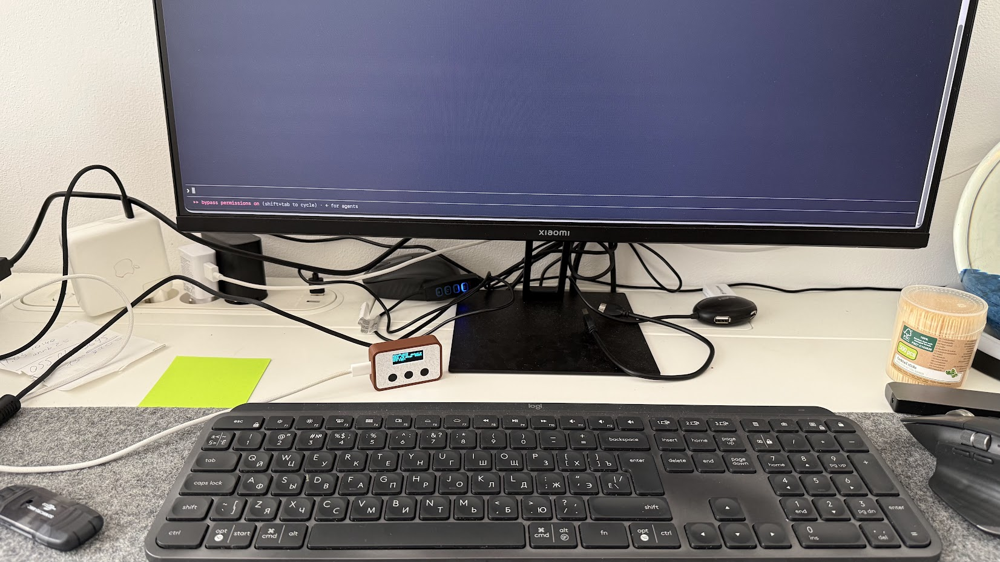
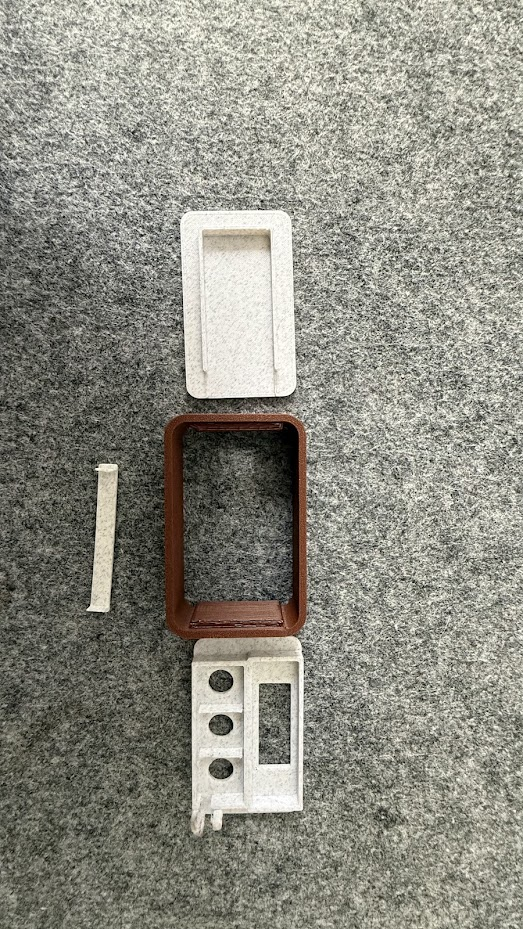
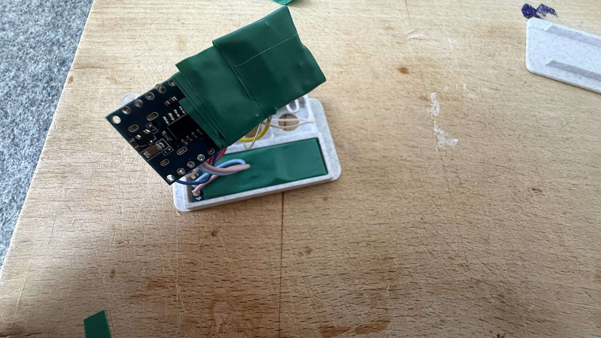

# Claude Mate

[](https://github.com/vlgutv22/claude_mate/actions/workflows/ci.yml)
[](https://claude.com/claude-code)
[](LICENSE)
[](docs/INSTALL.md)
[](daemon/claude_mate_daemon.py)
[](firmware/claude_mate)
[](CONTRIBUTING.md)

<p align="center">
  
</p>

**Claude Mate exists to cut the cognitive overload of orchestrating many
AI-agent sessions at once** — a wall of Claude Code tabs spread across different
accounts and projects, each finishing, blocking, or erroring on its own
schedule. Instead of scanning every terminal to find the one that stalled, you
glance at a small desk device: one screen and an indication LED tell you *which*
session needs you *right now*, and a single button jumps you straight to it.

This is **iteration one** — an Arduino-based USB device for macOS. The next
iteration is a wireless **ESP32 Wi-Fi** remote, so the companion no longer has
to be tethered to the Mac (see [Roadmap](#roadmap)).

You feed it from the Claude Code **hooks** or the **PTY wrapper**
(`claude-mate-wrap`); it becomes an ambient, always-on triage pane for every
session you have open — in VS Code, the terminal CLI, iTerm2, tmux, anywhere.

```
        ┌───────────────────────┐
        │ api-server            │   ← r0: session name (flashes while its alert
        │ WAIT  0:42       work │   ← r1: state · time-in-state · account   is unacknowledged)
        │ Opus 4.8 xhigh  5h82% │   ← r2: model · effort · remaining limit
        │ 2/6 E B W D I         │   ← r3: queue position · whole-fleet letter strip
        └───────────────────────┘       (the active tab's letter sits in a wide centred filled rectangle)
              (•) indication LED               ← blinks per alert class, until you ack
          [ PREV ]   [ GO ]   [ NEXT ]         ← three buttons — same meaning, always
   PREV/NEXT: step the triage queue (hold = auto-repeat)   GO: short = ack + raise · double = FOLLOW · long = ack only

   the flash: name row inverting = unacknowledged (needs you) · steady = seen
   the strip: E error · B waiting · W working · D done · I idle — one letter per session, stable order
              a letter BLINKS while that tab's alert is unacknowledged; it goes steady once you ack it
   the box:   the active tab's letter is a wide centred filled rectangle (letter knocked out) — shows which tab is on screen
   the right edges: which ACCOUNT the session runs as (its wrapper profile) · how much of that account's plan
              limit is LEFT (5h82% = 82% of the 5-hour window · wk31% = 31% of the week — the tighter one shows)
   FOLLOW:    double-click GO → a ► marker appears; PREV/NEXT then also raise the selected terminal (raise only)
   the LED:   START 1 s blink · INPUT even blink · DONE 4-blink cascade · ERROR fast strobe  (loops until you GO/ack)
```

---

## Contents

- [What it is](#what-it-is)
- [Two ways to feed it](#two-ways-to-feed-it)
- [Features](#features)
- [Architecture](#architecture)
- [LED alerts & the acknowledge model](#led-alerts--the-acknowledge-model)
- [Bill of Materials](#bill-of-materials) · [Enclosure & 3D model](#enclosure--3d-model)
- [Quick start](#quick-start) · [Configuration](#configuration)
- [How the status maps to your sessions](#how-the-status-maps-to-your-sessions)
- [Roadmap](#roadmap)
- [Repository layout](#repository-layout)
- [Limitations](#limitations)
- [Changelog](#changelog)
- [License](#license)

---

## What it is

**Claude Mate** is an Arduino Nano + 0.91" I2C OLED + 3 buttons + an
**indication LED**, paired with a lightweight Python daemon on your Mac.

The daemon keeps ONE **stable, alphabetically-ordered** **triage queue** of every
Claude Code session (tabs never shuffle as their states change) and renders ONE
screen: the *selected* session, over a whole-fleet letter strip. Urgency is
tracked **separately** — it drives the LED and the blinking fleet letters,
never the tab order or which tab is shown. The LED blinks a status-distinct pattern for the worst
*unacknowledged* alert — so a single tab finishing, blocking, or erroring is
*seen* even while the rest of your fleet keeps working. It keeps blinking until
you deal with it. There are **no UI modes**: the three buttons — **PREV · GO ·
NEXT** — mean the same thing at all times.

The single must-have action is **GO**: press it and the window for the
displayed session is raised so you can deal with it — the integrated VS Code
panel *or* the actual terminal that session is running in (matched by TTY).
Raise **only**: nothing in the system ever collapses or resizes a window.
Retrying or resubmitting a turn is intentionally **out of scope** (see
[Limitations](#limitations)).

---

## Two ways to feed it

You can drive the daemon from **either or both** of these — mix freely:

| Path | What it is | What it can see |
|------|-----------|-----------------|
| **(a) Claude Code hooks** | `hooks/claude-status.sh`, wired to `UserPromptSubmit` / `Notification` / `Stop` / `StopFailure`. Fire-and-forget; never blocks or fails a turn. | Turn boundaries: started, needs-input, finished OK, finished on error. Works in the VS Code extension and the CLI. |
| **(b) PTY wrapper** `bin/claude-mate-wrap` | Run `claude` *through* a wrapper (`alias claude=claude-mate-wrap`). It forks a pseudo-terminal, relays stdin/stdout transparently, and mirrors the TUI into a headless terminal emulator to read the **live screen**. | Everything on screen the hooks can't report: the spinner, **API errors/retries**, **permission prompts**, interactive option-pickers, and *"Waiting for N dynamic workflow to finish"* — i.e. it knows a session is **still busy after the turn "ends"**. |

The wrapper is the more capable feed (true live state, plus terminal focus); the
hooks are the zero-dependency feed. Use whichever fits each session.

---

## Features

- **One stable, alphabetically-ordered triage queue** — every session in a
  fixed order (alphabetical by name, tiebroken by session key) so tabs **never
  shuffle under you** as their states change. **Urgency** is computed
  **separately** (worst unacknowledged alert: error → waiting → done, oldest
  first) and drives only the LED and the blinking fleet letters — never the
  tab order. **PREV** / **NEXT** step the order manually (hold to auto-repeat,
  wrapping at the ends); the screen **never changes subject on its own**.
- **No UI modes** — the three buttons mean the same thing at all times:
  **PREV · GO · NEXT**. A short **GO** acknowledges the shown alert **and
  raises its window**; a **long-press of GO** (~0.5 s) acknowledges it
  **without** touching any window. Buttons fire instantly (edge-accepted
  ~40 ms debounce), and every accepted press inverts the whole panel for
  ~80 ms — instant "the device heard you" feedback.
- **No auto-switch, ever** — the selection is **sticky**: only PREV/NEXT/GO
  move it, and a GO/ACK stays on the tab it acted on. An alert on another tab
  announces itself through the LED and its **blinking fleet letter**; the view
  stays exactly where you left it until you navigate.
- **Navigation never touches windows** — the ONLY window operation in the
  whole system is GO, and it only **raises/activates**; the daemon never
  collapses, resizes, or miniaturizes anything.
- **GO is WYSIWYG** — GO/ACK act on exactly the session whose name is on the
  glass, never a freshly recomputed most-urgent alert. So a press can only ever
  raise the terminal you are actually looking at.
- **Status-distinct LED alerts** — the indication LED blinks the pattern of the
  *worst unacknowledged* alert across the whole fleet:
  - **START** — a job (re)started → one long 1 s blink (one-shot).
  - **INPUT** — a session is waiting on you → an aggressive even blink
    (~2.8 Hz), **looping** until you ack it.
  - **DONE** — a turn finished → a cascade of 4 quick blinks, then a pause,
    **looping** until you ack it.
  - **ERROR** — a turn ended on an API error → a super-aggressive ~7 Hz
    strobe, **looping** until you ack it.

  The loops run in the firmware until the daemon sends `V|OFF` (a GO/ACK, or
  the state changes on its own). If the daemon dies mid-alert the firmware
  stops the loop on its own after ~30 s of silence — and shows **LINK LOST**.
- **"Finished but not seen" model** — when a turn ends, the session becomes
  **done** and *stays* done (name flashing, LED looping) until you acknowledge
  it; later idle keepalives don't silently clear it. GO (or a long-press ACK)
  acknowledges it.
- **Flashing name row** — while the shown session's alert is unacknowledged,
  the top name row inverts at ~2.5 Hz; once acknowledged it goes steady. At
  a glance you know whether you've seen it.
- **Whole-fleet strip** — the bottom row shows your queue position
  (`pos/total`) plus one status letter per session in stable (alphabetical)
  order, **space-separated**: `E` error · `B` waiting · `W` working · `D` done ·
  `I` idle. A letter **blinks** while that tab's alert is unacknowledged.
- **Live time-in-state** — the state row counts up how long the session has
  been in its current state: for a `working` tab that IS the live turn
  runtime; for an alert it is how long it has been waiting on *you*.
- **One-button FOCUS** — GO raises the session's window: first the **PTY
  wrapper's own terminal** (iTerm2 / Terminal.app / VS Code / Ghostty / Warp /
  tmux, matched by TTY), else a **VS Code deep link**, else the VS Code window
  for the workspace folder. Raise only, always.
- **Honest link state** — with no daemon frame yet the firmware shows a boot
  splash; after ~30 s of daemon silence it replaces the stale frame with a
  **LINK LOST** screen (`NO LINK / waiting for daemon`) instead of freezing,
  and recovers on the next parsed line.
- **Hot-reloadable detection** — the wrapper's state patterns live in
  [`patterns.json`](patterns.json) and reload live (~0.25 s, no restart), so you
  can tune what counts as error/waiting/busy without touching code.
- **Robust by design** — the daemon keeps the serial port open continuously,
  auto-detects and auto-reconnects to the device, never crashes on a missing
  port; the hooks never block a turn; the wrapper falls back to running `claude`
  directly if anything is wrong.
- **`--mock` demo mode** — run the whole display with fake sessions cycling
  through every state, no Claude and no hardware required.

---

## Architecture

```
   Claude Code session
   ├─ (a) hooks ─ ~/.claude/hooks/claude-status.sh
   │                 "<state>|<sid>|<name>\n"
   │
   └─ (b) PTY wrapper ─ bin/claude-mate-wrap  (alias claude=claude-mate-wrap)
                     "<state>|<sid>|<name>|<ctrl_sock>|<model>|<effort>\n"   + screen-scrapes the live TUI
                            │
                            ▼
              Unix domain socket  /tmp/claude-mate.sock
                            │
                            ▼
   ┌──────────────────────────────────────────────┐
   │   Python daemon (Mac)                        │
   │   • ONE triage queue + "done-until-acked"    │   (STABLE alphabetical order —
   │   • ONE pre-rendered screen                  │    tabs never shuffle; urgency separate)
   │       F|<flags>|<sel>|<r0>|<r1>|<r2>|<r3>          │
   │   • LED policy  V|<START/INPUT/DONE/ERR/OFF> │   worst unacked class, loops until ack
   │   • GO: raise the session's window — RAISE   │
   │     ONLY (wrapper ctrl-sock → VS Code link)  │
   └──────────────────────────────────────────────┘
                            │  USB serial 115200 8N1, "|"-delimited ASCII
                            ▼
   ┌──────────────────────────────────────────────┐
   │   Arduino Nano (ATmega328P)                  │
   │   • SSD1306 128x32 OLED — draws the one      │
   │     frame it was last sent (dumb renderer)   │
   │   • indication LED (D8) plays V|<KIND>       │
   │   • PREV/GO/NEXT buttons → B|P B|N B|G B|K   │
   └──────────────────────────────────────────────┘
                            │  H (hello on boot), B|<x> (buttons)
                            └──────────────► back to the daemon
```

Two control flows worth calling out:

- **FOCUS round-trip.** Each wrapped session opens a per-session control socket
  (`/tmp/claude-mate-ctrl-<id>.sock`) and tells the daemon about it. On a GO
  press the daemon connects to that socket and sends the single verb `focus`;
  the wrapper raises *its own* terminal window using the right method for
  `$TERM_PROGRAM` (iTerm2 and Terminal.app match the exact tab by TTY), replying
  `go` on receipt and `ok` when the window op completed — so consecutive GO
  presses raise windows in press order. Hook-only sessions fall back to a
  VS Code deep link / window raise.
- **Reset recovery.** Opening the USB serial port resets the Nano (~1.5 s). On
  boot the Arduino emits `H`; the daemon responds by re-sending the full current
  state (the current frame + re-arming the LED loop), so the display recovers
  cleanly after any reconnect.

> The **triage queue** is a **stable, alphabetically-ordered** list of sessions —
> tabs never reorder as their states change. **Urgency** (worst unacknowledged
> **error > waiting > done**, oldest first) is tracked **separately** and drives
> only the LED and the blinking fleet letters, never the tab order or the shown
> tab (the selection is sticky). The OLED's top row is the selected session's
> **name**; its state (`ERR`/`WAIT`/`DONE`/`WORK`/`IDLE`) leads the second row.

---

## LED alerts & the acknowledge model

The LED is driven **entirely by the daemon** via `V|<KIND>` lines — the
firmware just plays the pattern on D8; the screen never blinks the LED on its
own. The pattern is always the class of the **worst unacknowledged alert**
across all sessions (`ERROR` > `INPUT` > `DONE`), so the LED loops exactly
while something needs you:

| Event | `V|` kind | LED pattern | Repeat until acked |
|-------|-----------|-------------|--------------------|
| Job (re)started (nothing else pending) | `START` | one long 1 s blink, then dark | — (one-shot) |
| Waiting on you      | `INPUT`   | aggressive even blink (~2.8 Hz) | **loops** continuously |
| Turn finished       | `DONE`    | cascade — 4 quick blinks, then a pause | **loops** continuously |
| Error / retry       | `ERROR`   | super-aggressive fast strobe (~7 Hz) | **loops** continuously |

The loops run in the firmware until the daemon sends `V|OFF`. A turn ending
becomes **done** and keeps looping until you acknowledge the session — raising
it (**GO** short-press) or silencing it in place (**GO** long-press, no window
op) acknowledges it: a done tab becomes idle; a waiting/error tab goes quiet
but keeps its state until it changes. An alert can also die by
**auto-resolving** (the session leaves the alert class on its own — you
answered in the terminal) or by **TTL pruning**; nothing else removes one. A
session re-entering the same alert class within ~5 s of being acknowledged
stays acknowledged, so a bouncing detector can't re-fire the LED you just
silenced. The flashing name row mirrors the ack state: inverting while
unacknowledged, steady once seen. If the daemon ever dies mid-alert, the
firmware stops the loop on its own after ~30 s of serial silence and shows the
**LINK LOST** screen.

---

## Bill of Materials

| Qty | Part                                    | Notes                                  |
|-----|-----------------------------------------|----------------------------------------|
| 1   | Arduino Nano (ATmega328P)               | Any USB-serial Nano clone works        |
| 1   | SSD1306 0.91" 128×32 OLED, I2C           | Address `0x3C` (some boards `0x3D`); 0.96" 128×64 also works |
| 3   | Momentary push buttons                  | PREV, GO, NEXT                         |
| 1   | LED + ~220 Ω–1 kΩ resistor              | indication LED on D8 (the sole alert output) |
| —   | Jumper wires, breadboard / perfboard    |                                        |
| 1   | USB cable (to the Mac)                   | Data-capable, not charge-only          |

> The indication LED is the **sole alert output**: wire it on **D8 through a
> ~220 Ω–1 kΩ series resistor** to GND so the pin isn't over-driven, and keep
> all grounds common. See [docs/WIRING.md](docs/WIRING.md).

Pinout summary (full details in [docs/WIRING.md](docs/WIRING.md)):

| Signal               | Pin       | Notes                                  |
|----------------------|-----------|----------------------------------------|
| OLED SDA             | A4        | I2C data                               |
| OLED SCL             | A3        | **software (bit-banged) I2C** — hardware SCL A5 was damaged; see `firmware/claude_mate/softssd1306.h` |
| GO button            | D2        | `INPUT_PULLUP`, emits `B|G` short (single = ack + raise; double-click = toggle FOLLOW) / `B|K` long (ack only) |
| NEXT button          | D3        | `INPUT_PULLUP`, emits `B|N` (selection down; auto-repeats while held) |
| PREV button          | D4        | `INPUT_PULLUP`, emits `B|P` (selection up; auto-repeats while held) |
| Indication LED       | D8        | LED + series resistor to GND; plays the `V|<kind>` alert pattern |

The three buttons use `INPUT_PULLUP` (other leg to GND; pressed = LOW), laid
out left→right as **PREV | GO | NEXT**.

---

## Enclosure & 3D model

The device lives in a two-part 3D-printed enclosure — a terracotta body with a
felt-textured faceplate, with cut-outs for the 0.91" OLED and the three
buttons. The printable model is
[`assets/3d-model/claude_mate_v2.3mf`](assets/3d-model/claude_mate_v2.3mf) (3MF —
open it in Bambu Studio, PrusaSlicer, or Cura). Print one for **personal use**
under the project's non-commercial license.

| On the desk | Printed enclosure | Inside |
|:---:|:---:|:---:|
| [](assets/photos/IMG_4911.jpg) | [](assets/photos/IMG_4896.jpg) | [](assets/photos/IMG_4900.jpg) |

More build photos are in [`assets/photos/`](assets/photos/).

---

## Quick start

1. **Build & flash the firmware** (`firmware/claude_mate/claude_mate.ino`) onto
   the Arduino Nano. Install **Adafruit GFX** via the Arduino Library Manager —
   it is the only external library needed (the SSD1306 itself is driven by the
   bundled `softssd1306.h`, a software-I2C `Adafruit_GFX` subclass).
2. **Run the daemon** on your Mac:
   ```sh
   python3 daemon/claude_mate_daemon.py
   ```
   Try it with no hardware/Claude first:
   ```sh
   python3 daemon/claude_mate_daemon.py --mock
   ```
3. **Feed it.** Pick either (or both):
   - **Hooks:** install the Claude Code hooks so session events reach the daemon.
   - **PTY wrapper:** `pip install pyte`, then run Claude through the wrapper:
     ```sh
     alias claude="$PWD/bin/claude-mate-wrap"
     claude            # use Claude exactly as normal — now with live state + FOCUS
     ```
     The wrapper is safe to install as a global `claude` shim: non-interactive
     (`claude -p …`, pipes, CI) execs the real binary, and it locates the real
     `claude` even when every `claude` on `PATH` is your own shim.

Step-by-step guides:

- 📦 **Install** — [docs/INSTALL.md](docs/INSTALL.md)
- 🔌 **Wiring** — [docs/WIRING.md](docs/WIRING.md)
- 📡 **Serial protocol** — [docs/PROTOCOL.md](docs/PROTOCOL.md)
- ✅ **Testing** — [docs/TESTING.md](docs/TESTING.md)

### Configuration

**Daemon** environment variables (all optional):

| Variable            | Default          | Meaning                                   |
|---------------------|------------------|-------------------------------------------|
| `CLAUDE_MATE_PORT`  | autodetect       | Serial device. Autodetects `/dev/cu.usbserial*` then `/dev/cu.usbmodem*` |
| `CLAUDE_MATE_SOCK`  | `/tmp/claude-mate.sock` | Unix socket the hooks/wrapper write to |
| `CLAUDE_MATE_BAUD`  | `115200`         | Serial baud rate                          |

**PTY wrapper** environment variables:

| Variable               | Default               | Meaning                                |
|------------------------|-----------------------|----------------------------------------|
| `CLAUDE_MATE_SOCK`     | `/tmp/claude-mate.sock` | Daemon socket to report state to     |
| `CLAUDE_MATE_PATTERNS` | `<repo>/patterns.json`  | Detection patterns file (hot-reloaded) |
| `CLAUDE_MATE_DEBUG`    | unset                 | If set to a path, append screen + state snapshots there (debugging) |
| `CLAUDE_REAL`          | autodetect            | Explicit path to the real `claude` binary |
| `CLAUDE_MATE_ACCOUNTS_DIR` | `~/.claude-accounts` | Root of account profile dirs (see below) |
| `CLAUDE_MATE_ACCOUNT`  | unset                 | Profile name to use, skipping the picker |
| `CLAUDE_MATE_USAGE_POLL_S` | `120`             | Remaining-limit poll period in seconds (`<= 0` disables) |

**Account profiles** — Claude Code holds one login per config dir, so the
wrapper can run different terminals under different accounts by pointing each
session at its own `CLAUDE_CONFIG_DIR`. Every subdirectory of
`~/.claude-accounts` is a profile; create one with `mkdir -p
~/.claude-accounts/work` (or by typing a new name at the picker). Once at
least one profile exists, every interactive start shows a picker listing each
profile with the email logged into it — press Enter for your default
`~/.claude` login, or pick a number. `claude --account work …` (the flag is
consumed by the wrapper, never passed to claude) or `CLAUDE_MATE_ACCOUNT=work`
selects a profile non-interactively, and an already-exported
`CLAUDE_CONFIG_DIR` always wins. A fresh profile starts logged out — claude
prompts `/login` there on first run — and keeps its own settings, history, and
MCP config. With no profile dirs, nothing changes.

**Account + remaining limit on the device** — each wrapped session reports
which account it runs as (the profile name, or `default`), shown right-aligned
on the state row, and how much of that account's plan limit is left, shown as
a chip on the model+effort row: `5h82%` = 82% of the 5-hour window remaining,
`wk31%` = 31% of the week — whichever window is more depleted. The wrapper
reads the session's own OAuth token (from `<config-dir>/.credentials.json`, or
the macOS Keychain where Claude Code keeps it) and polls Anthropic's usage
endpoint every `CLAUDE_MATE_USAGE_POLL_S` seconds (default 120; `<= 0`
disables). Read-only: the wrapper never refreshes or rewrites credentials —
that stays claude's job.

**Detection tuning** lives in [`patterns.json`](patterns.json) — case-insensitive
substrings matched against the rendered TUI, grouped as `error` / `waiting` /
`waiting_footer` / `busy` (precedence: error > waiting > waiting_footer > busy >
idle). Matching is scoped to Claude's **live status region** (the bottom ~20
non-empty lines) for error/waiting/busy, and to the **footer** (~4 lines) for the
generic picker phrases — so the same keywords in scrollback, logs, code, or
conversation above don't false-trigger. The footer phrases are limited to
`to select` / `to navigate` (a real question picker), and a footer-only `waiting`
must **persist a couple of seconds** before it reports — so a config dialog you
open and dismiss (the `/effort` or `/model` slider, whose footer is
`… · Esc to cancel`) no longer alerts the instant you open it.

---

## How the status maps to your sessions

The daemon keeps one record per session (keyed by `session_id`, or by name if no
id is provided). Each session is in one of these states:

| State     | Triggered by                          | Meaning                                  |
|-----------|---------------------------------------|------------------------------------------|
| `working` | `UserPromptSubmit` / wrapper "busy"   | A turn is in progress (or a background workflow is still running) |
| `waiting` | `Notification` / wrapper prompt+picker | Needs permission, a question, or a menu choice |
| `error`   | `StopFailure` / wrapper API-error      | Turn ended on an API error (5xx / overloaded / timeout / usage limit) |
| `done`    | `Stop` (then held until acknowledged)  | Turn completed OK — keeps alerting until you GO/ack |
| `idle`    | Inactivity (TTL) / acknowledged done   | No active turn                            |

The daemon keeps the **triage queue** in a **stable, alphabetical order** (tabs
never shuffle as their states change) and computes **urgency separately**:

```
tab order:  STABLE — alphabetical by name (tiebreak: session key)
urgency:    worst UNACKNOWLEDGED alert (error > waiting > done, oldest first)
            → drives the LED loop + the blinking fleet letters only,
              never the order and never the shown tab
```

Urgency is the **priority model** for two things only: what the LED blinks
about, and which fleet letters blink on the strip. The shown tab is **sticky**:
the screen never switches on its own — you navigate with PREV/NEXT. The LED
pattern is always the class of the worst *unacknowledged* alert (`ERROR` >
`INPUT` > `DONE`), dropping to `V|OFF` when nothing needs you. GO/ACK act on the
session **currently shown** (WYSIWYG) and never move the tab order. With zero
sessions the OLED shows `MATE / no sessions`.

---

## Roadmap

Claude Mate is built in iterations, each removing more friction than the last.

- **Iteration 1 — Arduino + macOS (this repo).** An Arduino Nano drives the
  OLED, the three buttons, and the indication LED over **USB serial**; a Python
  daemon on the Mac keeps the triage queue, renders the screen, and raises
  windows. Tethered by USB to the machine it watches.
- **Iteration 2 — ESP32 Wi-Fi remote (next).** Move to an **ESP32** so the
  device talks to the daemon **over Wi-Fi** instead of USB — a genuinely
  wireless desk remote you can place anywhere, with no cable to the Mac. Same
  triage model and line protocol; the transport becomes the network. (A richer
  display and on-battery operation are natural follow-ons.)

The goal stays fixed across every iteration: **one calm surface that tells you
which agent needs you, so running many of them in parallel stops taxing your
attention.**

---

## Repository layout

```
claude_mate/
├── README.md
├── LICENSE · CONTRIBUTING.md · CODE_OF_CONDUCT.md · SECURITY.md
├── patterns.json                  # hot-reloadable state-detection tuning
├── assets/                       # device photos + printable 3D enclosure (.3mf)
├── bin/
│   └── claude-mate-wrap           # PTY wrapper: live state + terminal FOCUS (pyte)
├── daemon/
│   └── claude_mate_daemon.py      # Python daemon (pyserial only)
├── firmware/
│   ├── claude_mate/               # Arduino sketch (one-frame OLED renderer + LED)
│   └── selftest/                  # hardware self-test sketch
├── hooks/
│   ├── claude-status.sh           # installed to ~/.claude/hooks/
│   └── settings.snippet.json      # the four hook wirings
├── install/                       # install.sh / uninstall.sh / LaunchAgent plist
├── packaging/                     # notarizable macOS .pkg installer
├── tools/                         # feed.sh + e2e / wrapper / settings-merge tests
└── docs/
    ├── INSTALL.md · WIRING.md · PROTOCOL.md · TESTING.md · ARCHITECTURE.md
```

---

## Limitations

- **Retry/resubmit is out of scope.** When a turn ends on an error, Claude Mate
  shows it (a flashing `ERR` frame + the looping ~7 Hz LED strobe until you ack
  it) but does **not** offer a "retry" action. Reliably resubmitting a turn from outside the
  GUI is not feasible, so GO — taking you to the session — is the intended
  response.
- **Model/effort strings are best-effort.** The model/effort row (e.g.
  `Opus 4.8 xhigh`) is scraped from the live TUI by the PTY wrapper and
  stays empty for hook-only sessions or until scraped. Claude Mate never
  fabricates it; treat this as an extension point.
- **The remaining-limit chip is best-effort too.** It comes from Anthropic's
  OAuth usage endpoint (an undocumented interface that may change), polled with
  the session's own token. Offline / expired-token / console-account sessions
  simply show no chip (or keep the last known value until a poll succeeds).
- **FOCUS targets the wrapper's terminal first, then VS Code.** A wrapped session
  raises **only its own** terminal window (matched by TTY, brought forward with
  `AXRaise`) — not the whole app's window group, so GO never drags sibling
  terminal windows forward. This needs **Accessibility** permission for your
  terminal app; without it the wrapper falls back to activating the app (which
  raises its windows as a group). Raise is the *only* window operation; nothing
  is ever collapsed or resized. Hook-only sessions fall back to a VS Code deep
  link, then to raising the VS Code window for the workspace folder — the exact
  deep-link URI lives behind a single config constant so it is trivial to update.
- **Detection is screen-scrape-based (wrapper).** State is inferred from the
  rendered TUI using `patterns.json`. It is scoped to the live status region to
  avoid false positives, but unusual terminal themes/locales may need a pattern
  tweak — which you can do live, no restart.
- **macOS-focused.** The daemon and wrapper target a Mac (serial device naming,
  `open`, AppleScript focus). Other platforms would need port/focus adjustments.

---

## Changelog

Dated release notes live in **[CHANGELOG.md](CHANGELOG.md)** — the from-zero
interface rewrite, account profiles, the on-device account + remaining-limit
chip, and the move to a fully sticky selection.

---

## License

**Creative Commons Attribution-NonCommercial 4.0 International (CC BY-NC 4.0)** —
see [LICENSE](LICENSE). This covers the whole repo: the software, the Arduino
firmware, the hardware design, the 3D-printable enclosure, the photos, and the
documentation.

- ✅ **Personal, non-commercial use** — build one for yourself, modify it, share
  it, and contribute changes back, with attribution.
- ❌ **No commercial use** — you may not sell the device, the models, or a
  service built on this work, or otherwise use it for commercial advantage.

Because of the non-commercial restriction this is **source-available** rather
than an OSI-approved "open-source" license — but the source is fully open for
personal use and contributions. © 2026 Volodymyr Gutorov and the Claude Mate
contributors.
