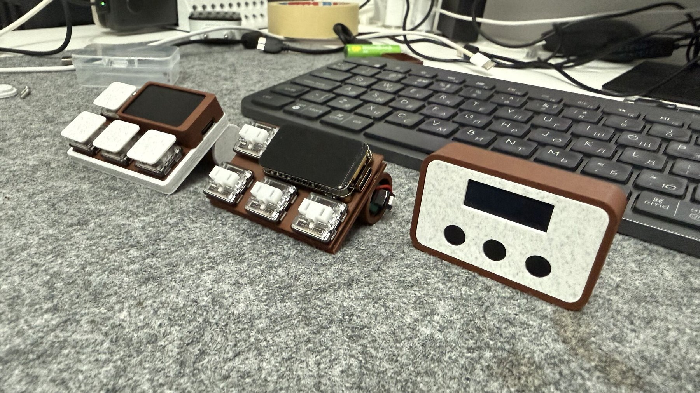
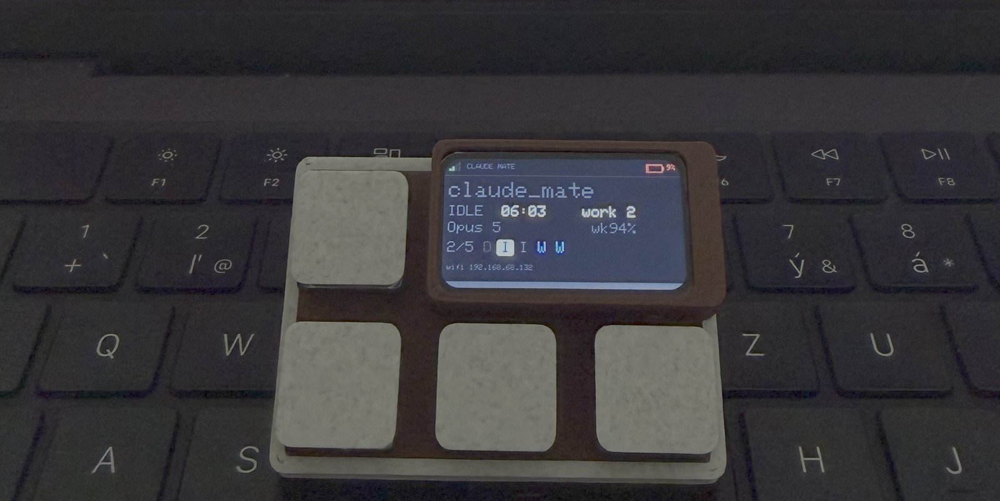
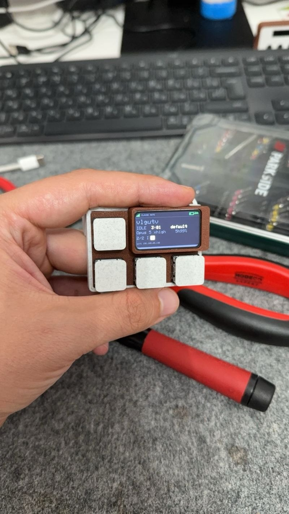
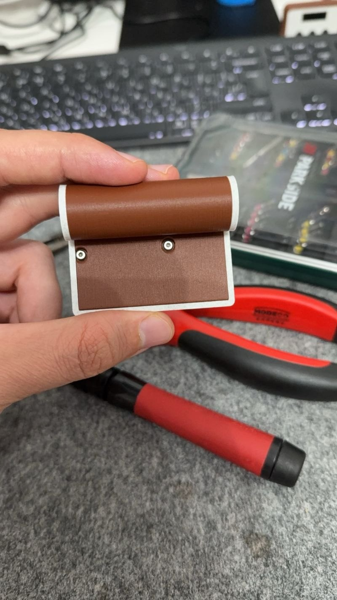
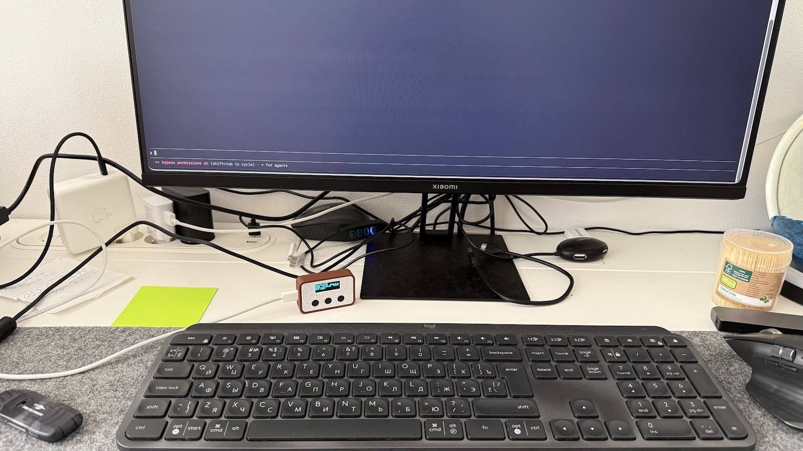
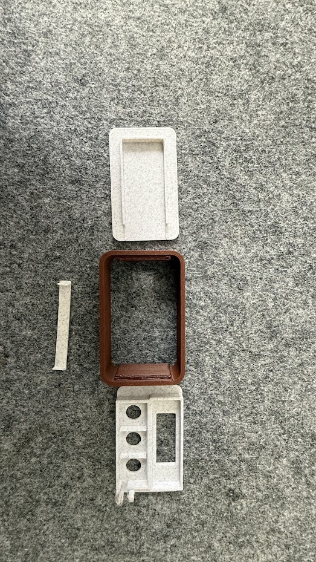
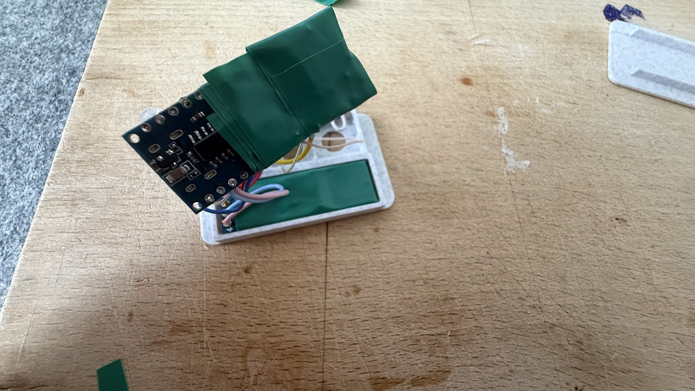

# Claude Mate

[](https://github.com/vlgutv22/claude_mate/actions/workflows/ci.yml)
[](https://claude.com/claude-code)
[](LICENSE)
[](docs/INSTALL.md)
[](daemon/claude_mate_daemon.py)
[](firmware/claude_mate)
[](firmware/claude_mate_s3)
[](CONTRIBUTING.md)

<p align="center">
  
</p>

<p align="center"><sub><b>Two devices, one protocol.</b> Left and centre: iteration 2, the
cordless ESP32-S3 keypad (assembled, and opened around its cell). Right: iteration 1, the
USB Arduino Nano box.</sub></p>

**Claude Mate exists to cut the cognitive overload of orchestrating many
AI-agent sessions at once** — a wall of Claude Code tabs spread across different
accounts and projects, each finishing, blocking, or erroring on its own
schedule. Instead of scanning every terminal to find the one that stalled, you
glance at a small desk device: one screen and an indication LED tell you *which*
session needs you *right now*, and a single button jumps you straight to it.

**There are two devices, speaking one protocol, byte for byte.** The original
**Arduino Nano** over USB, and a cordless **ESP32-S3** with a 172×320 colour
screen that reaches the daemon over Wi-Fi, runs on a 14500 cell, and can open a
**live mirror of a session's actual terminal**. The daemon cannot tell them
apart: either works on its own, or **both at once** (see
[Bill of Materials](#bill-of-materials), [Roadmap](#roadmap) and
[`firmware/README.md`](firmware/README.md)).

You feed it from the Claude Code **hooks** or the **PTY wrapper**
(`claude-mate-wrap`); it becomes an ambient, always-on triage pane for every
session you have open — in VS Code, the terminal CLI, iTerm2, tmux, anywhere.

**Iteration 2 — ESP32-S3, 172×320 colour IPS, cordless:**

```
        ┌──────────────────────────────────────┐
        │ ▁▄█ CLAUDE MATE               ▰ 64%  │  ← status bar: Wi-Fi link · battery (with charging)
        ├──────────────────────────────────────┤
        │ api-server                           │  ← r0: session name, in the state's colour
        │ WAIT   0:42                   work   │  ← r1: state · time-in-state · account
        │ Opus 5 xhigh                 5h82%   │  ← r2: model · effort · remaining limit
        │ 2/6  E  B  W  D  I                   │  ← r3: queue position · fleet strip, letter-coloured
        │ wifi 192.168.1.42                    │  ← link detail (firmware-local, never from the daemon)
        │══════════════════════════════════════│  ← accent bar in the selected session's state colour
        └──────────────────────────────────────┘
                  (•) WS2812 — rhythm AND colour
        [ PREV ]  [ GO ]  [ NEXT ]  [ MENU ]       ← a fourth button, with three gestures
   MENU: tap = the selected session's real terminal · double-tap = the on-device menu
         hold 2 s = long sleep (a tap wakes the board)
```

**Iteration 1 — Arduino Nano, 128×32 mono OLED, USB:**

```
        ┌───────────────────────┐
        │ api-server            │   ← r0: session name (flashes while its alert
        │ WAIT  0:42       work │   ← r1: state · time-in-state · account   is unacknowledged)
        │ Opus 5 xhigh    5h82% │   ← r2: model · effort · remaining limit
        │ 2/6 E B W D I         │   ← r3: queue position · whole-fleet letter strip
        └───────────────────────┘       (the active tab's letter sits in a wide centred filled rectangle)
              (•) indication LED               ← blinks per alert class, until you ack
          [ PREV ]   [ GO ]   [ NEXT ]         ← three buttons — same meaning, always
   PREV/NEXT: step the triage queue (hold = auto-repeat)   GO: short = ack + raise · double = FOLLOW · long = ack only

   the flash: name row inverting = unacknowledged (needs you) · steady = seen
   the strip: E error · B waiting · W working · D done · I idle — one letter per session, stable order
              a letter BLINKS while that tab's alert is unacknowledged; it goes steady once you ack it
   the box:   the active tab's letter is a wide centred filled rectangle (letter knocked out) — shows which tab is on screen
   the right edges: which ACCOUNT the session runs as (its wrapper profile) · how much of that account's plan
              limit is LEFT (5h82% = 82% of the 5-hour window · wk31% = 31% of the week — the tighter one shows)
   FOLLOW:    double-click GO → a ► marker appears; PREV/NEXT then also raise the selected terminal (raise only)
   the LED:   START 1 s blink · INPUT even blink · DONE 4-blink cascade · ERROR fast strobe  (loops until you GO/ack)
```

---

## Contents

- [What it is](#what-it-is)
- [The terminal mirror (ESP32-S3)](#the-terminal-mirror-esp32-s3)
- [Two ways to feed it](#two-ways-to-feed-it)
- [Features](#features)
- [Architecture](#architecture)
- [LED alerts & the acknowledge model](#led-alerts--the-acknowledge-model)
- [Bill of Materials](#bill-of-materials) · [Enclosures & 3D models](#enclosures--3d-models)
- [Quick start](#quick-start) · [Configuration](#configuration)
- [How the status maps to your sessions](#how-the-status-maps-to-your-sessions)
- [Roadmap](#roadmap)
- [Repository layout](#repository-layout)
- [Limitations](#limitations)
- [Changelog](#changelog)
- [License](#license)

---

## What it is

**Claude Mate** is a small desk companion paired with a lightweight Python
daemon on your Mac. Build it either way — or both, at the same time:

| | **Iteration 1** — `claude_mate/` | **Iteration 2** — `claude_mate_s3/` |
|---|---|---|
| Board | Arduino Nano (ATmega328P) | Waveshare ESP32-S3-LCD-1.47**B** |
| Display | 0.91" 128×32 mono OLED (SSD1306) | 1.47" 172×320 colour IPS (ST7789) |
| Transport | USB serial | **Wi-Fi (TCP)**, USB as fallback |
| Buttons | 3 — PREV / GO / NEXT | 4 — + **MENU** (Kailh Choc low-profile) |
| Alert light | one LED, rhythm only | WS2812, rhythm **+ colour** |
| Power | USB | USB **or** a 14500 cell, with a gauge |
| Extra | — | a **live mirror** of a session's terminal |

The daemon keeps ONE **stable, alphabetically-ordered** **triage queue** of every
Claude Code session (tabs never shuffle as their states change) and renders ONE
screen: the *selected* session, over a whole-fleet letter strip. Urgency is
tracked **separately** — it drives the LED and the blinking fleet letters,
never the tab order or which tab is shown. The LED blinks a status-distinct pattern for the worst
*unacknowledged* alert — so a single tab finishing, blocking, or erroring is
*seen* even while the rest of your fleet keeps working. It keeps blinking until
you deal with it. There are **no UI modes**: the buttons — **PREV · GO · NEXT**,
and **MENU** on the S3 — mean the same thing at all times.

The single must-have action is **GO**: press it and the window for the
displayed session is raised so you can deal with it — the integrated VS Code
panel *or* the actual terminal that session is running in (matched by TTY).
Raise **only**: nothing in the system ever collapses or resizes a window.
Retrying or resubmitting a turn is intentionally **out of scope** (see
[Limitations](#limitations)).

The extra pixels on the S3 buy **typography, colour and the terminal mirror** —
never a different information model. The daemon pre-renders the same four rows
of at most 21 characters for both devices; each just draws what it was sent.

---

## The terminal mirror (ESP32-S3)

Tapping the **4th button** opens a live view of the selected session's *actual
terminal* on the device — 52×17 characters, refreshed about once a second.
**PREV/NEXT** then scroll it instead of moving the selection, and **GO** closes
it and raises the real window. Only **wrapped** sessions can be mirrored: a
hook-only session has no PTY for the daemon to read, and the device says so.

It adds no new channel. The PTY wrapper already mirrored the full TUI into
[pyte](https://github.com/selectel/pyte) (it was only being mined for state and
the model/effort strings), and the daemon already held a per-session control
socket to every wrapper for `focus`. The mirror is one more request/response on
that socket — so polling runs **only while the view is open**, and an unwatched
fleet costs nothing.

> ⚠️ **The mirror puts raw terminal output on the network.** The handshake is
> authenticated, but the session itself is **plaintext TCP** — and terminal
> contents can include keys, tokens and file contents, which is a materially
> larger exposure than shipping `WAIT` and a model name. Keep it to networks you
> trust. `--tcp` is opt-in and fails closed without a token.

---

## Two ways to feed it

You can drive the daemon from **either or both** of these — mix freely:

| Path | What it is | What it can see |
|------|-----------|-----------------|
| **(a) Claude Code hooks** | `hooks/claude-status.sh`, wired to `UserPromptSubmit` / `Notification` / `Stop` / `StopFailure`. Fire-and-forget; never blocks or fails a turn. | Turn boundaries: started, needs-input, finished OK, finished on error — plus the **background work Claude reports on `Stop`** (`background_tasks` entries whose own `status` is still in flight, plus one-shot `session_crons`), so a turn that ends with work still running reports `working`, not a premature DONE — while a task listed as already finished is not counted, because the next `Stop` that would correct it may never come. Works in the VS Code extension and the CLI. |
| **(b) PTY wrapper** `bin/claude-mate-wrap` | Run `claude` *through* a wrapper (`alias claude=claude-mate-wrap`). It forks a pseudo-terminal, relays stdin/stdout transparently, and mirrors the TUI into a headless terminal emulator to read the **live screen**. | Everything on screen the hooks can't report: the spinner, **API errors/retries**, **permission prompts**, interactive option-pickers, and every **background-work** tell — the *"Waiting for N dynamic workflow to finish"* banner, the turn recap's *"· 1 shell still running"* suffix and the **live in-flight chip** in the hint row — i.e. it knows a session is **still busy after the turn "ends"**, including work that is only queued, and knows when it has stopped being busy. |

The wrapper is the more capable feed (true live state, plus terminal focus); the
hooks are the zero-dependency feed. Use whichever fits each session.

---

## Features

- **One stable, alphabetically-ordered triage queue** — every session in a
  fixed order (alphabetical by name, tiebroken by session key) so tabs **never
  shuffle under you** as their states change. **Urgency** is computed
  **separately** (worst unacknowledged alert: error → waiting → done, oldest
  first) and drives only the LED and the blinking fleet letters — never the
  tab order. **PREV** / **NEXT** step the order manually (hold to auto-repeat,
  wrapping at the ends); the screen **never changes subject on its own**.
- **No UI modes** — the buttons mean the same thing at all times:
  **PREV · GO · NEXT** (plus **MENU** on the S3). A short **GO** acknowledges
  the shown alert **and raises its window**; a **long-press of GO** (~0.5 s)
  acknowledges it **without** touching any window. Buttons fire instantly
  (edge-accepted ~40 ms debounce), and every accepted press flashes the device
  for ~80 ms — the Nano inverts the whole panel, the S3 turns its accent bar
  white — instant "the device heard you" feedback, well before the daemon
  round-trips a new frame.
- **No auto-switch, ever** — the selection is **sticky**: only PREV/NEXT/GO
  move it, and a GO/ACK stays on the tab it acted on. An alert on another tab
  announces itself through the LED and its **blinking fleet letter**; the view
  stays exactly where you left it until you navigate.
- **Navigation never touches windows** — the ONLY window operation in the
  whole system is GO, and it only **raises/activates**; the daemon never
  collapses, resizes, or miniaturizes anything.
- **GO is WYSIWYG** — GO/ACK act on exactly the session whose name is on the
  glass, never a freshly recomputed most-urgent alert. So a press can only ever
  raise the terminal you are actually looking at.
- **Status-distinct LED alerts** — the indication LED blinks the pattern of the
  *worst unacknowledged* alert across the whole fleet:
  - **START** — a job (re)started → one long 1 s blink (one-shot).
  - **INPUT** — a session is waiting on you → an aggressive even blink
    (~2.8 Hz), **looping** until you ack it.
  - **DONE** — a turn finished → a cascade of 4 quick blinks, then a pause,
    **looping** until you ack it.
  - **ERROR** — a turn ended on an API error → a super-aggressive ~7 Hz
    strobe, **looping** until you ack it.

  The loops run in the firmware until the daemon sends `V|OFF` (a GO/ACK, or
  the state changes on its own). If the daemon dies mid-alert the firmware
  stops the loop on its own after ~30 s of silence — and shows **LINK LOST**.
- **"Finished but not seen" model** — when a turn ends, the session becomes
  **done** and *stays* done (name flashing, LED looping) until you acknowledge
  it; later idle keepalives don't silently clear it. GO (or a long-press ACK)
  acknowledges it.
- **Flashing name row** — while the shown session's alert is unacknowledged,
  the top name row inverts at ~2.5 Hz; once acknowledged it goes steady. At
  a glance you know whether you've seen it.
- **Whole-fleet strip** — the bottom row shows your queue position
  (`pos/total`) plus one status letter per session in stable (alphabetical)
  order, **space-separated**: `E` error · `B` waiting · `W` working · `D` done ·
  `I` idle. A letter **blinks** while that tab's alert is unacknowledged.
- **Live time-in-state** — the state row counts up how long the session has
  been in its current state: for a `working` tab that IS the live turn
  runtime; for an alert it is how long it has been waiting on *you*.
- **One-button FOCUS** — GO raises the session's window: first the **PTY
  wrapper's own terminal** (iTerm2 / Terminal.app / VS Code / Ghostty / Warp /
  tmux, matched by TTY), else a **VS Code deep link**, else the VS Code window
  for the workspace folder. Raise only, always.
- **Honest link state** — with no daemon frame yet the firmware shows a boot
  splash; after ~30 s of daemon silence it replaces the stale frame with a
  **LINK LOST** screen (`NO LINK / waiting for daemon`) instead of freezing,
  and recovers on the next parsed line.
- **Hot-reloadable detection** — the wrapper's state patterns live in
  [`patterns.json`](patterns.json) and reload live (~0.25 s, no restart), so you
  can tune what counts as error/waiting/busy without touching code.
- **Robust by design** — the daemon keeps the serial port open continuously,
  auto-detects and auto-reconnects to the device, never crashes on a missing
  port; the hooks never block a turn; the wrapper falls back to running `claude`
  directly if anything is wrong.
- **`--mock` demo mode** — run the whole display with fake sessions cycling
  through every state, no Claude and no hardware required.

**On the ESP32-S3, additionally:**

- **Cordless, on a cell** — Wi-Fi (TCP) instead of USB, discovered over mDNS
  and authenticated with a nonce/HMAC handshake in which the token never
  crosses the wire. Wi-Fi credentials, daemon address and token live in **NVS**,
  a separate partition, so they **survive a reflash**; an unprovisioned board
  raises a setup portal you join from a phone.
- **Colour as a second channel** — the WS2812 plays the same rhythm *and* the
  alert class's colour, and every fleet letter is drawn in its own state colour.
  The colours differ in **brightness** as well as hue, so they stay distinct for
  a red/green-colourblind reader and in direct sunlight.
- **A battery gauge that doesn't lie** — median-of-15 spaced samples plus an EMA
  across polls, because the board's sense divider is unfiltered and Wi-Fi TX
  bursts dip the rail. Charging is inferred in tiers from the cell's own
  voltage; the board exposes no charge-status line.
- **A live terminal mirror** — see [above](#the-terminal-mirror-esp32-s3).
- **An on-device menu** — double-tap the 4th button. Settings (screen sleep,
  brightness, alert-LED level including a genuine *off*, flip, factory reset),
  an About readout, the Wi-Fi setup portal, and long sleep. Entirely
  **firmware-local**: while it is up PREV/GO/NEXT are handled on the device and
  never emitted, so the queue cannot move while you are aiming at a settings row
  — and there is **no protocol change and no daemon change** for any of it.
- **A screen that turns itself off** — after 1–30 minutes, and only when nothing
  is waiting on you. What counts as waiting comes from the frame the device
  already has: a flashing name row, any lowercase fleet letter, or a *looping*
  LED — which the daemon drives from exactly "worst unacknowledged alert", so it
  is the authoritative signal. An alert turns the screen back on by itself. A
  `working` fleet does **not** hold it on — an hour of grinding with nothing to
  say is the case this exists for — and neither does `NO LINK`, because a dead
  daemon must not be able to burn the cell flat. A press on a dark screen only
  wakes, and is swallowed: GO raises a window, and obeying a press aimed at a
  screen you cannot read would sometimes yank you to the wrong session.
- **Long sleep** — hold the **4th button** for 2 s for deep sleep, tap to wake.
  Roughly a month of standby on a 14500; the WS2812 has no shutdown pin, so a
  switch in the battery lead is the only true zero.

---

## Architecture

```
   Claude Code session
   ├─ (a) hooks ─ ~/.claude/hooks/claude-status.sh
   │                 "<state>|<sid>|<name>\n"
   │
   └─ (b) PTY wrapper ─ bin/claude-mate-wrap  (alias claude=claude-mate-wrap)
                     "<state>|<sid>|<name>|<ctrl_sock>|<model>|<effort>\n"   + screen-scrapes the live TUI
                            │
                            ▼
              Unix domain socket  /tmp/claude-mate.sock
                            │
                            ▼
   ┌──────────────────────────────────────────────┐
   │   Python daemon (Mac)                        │
   │   • ONE triage queue + "done-until-acked"    │   (STABLE alphabetical order —
   │   • ONE pre-rendered screen                  │    tabs never shuffle; urgency separate)
   │       F|<flags>|<sel>|<r0>|<r1>|<r2>|<r3>          │
   │   • LED policy  V|<START/INPUT/DONE/ERR/OFF> │   worst unacked class, loops until ack
   │   • GO: raise the session's window — RAISE   │
   │     ONLY (wrapper ctrl-sock → VS Code link)  │
   │   • MIRROR: pull the session's live screen   │
   │     from its wrapper → M| lines (S3 only)    │
   └──────────────────────────────────────────────┘
             │                              │
   USB serial 115200 8N1        TCP :8787 (opt-in --tcp), mDNS-discovered,
   "|"-delimited ASCII          nonce/HMAC handshake — the token never
             │                  crosses the wire · SAME "|" lines
             ▼                              ▼
   ┌────────────────────────────┐  ┌──────────────────────────────────┐
   │  Arduino Nano (ATmega328P) │  │  ESP32-S3 (Waveshare -LCD-1.47B) │
   │  • SSD1306 128x32 OLED —   │  │  • ST7789 172x320 colour IPS —   │
   │    draws the one frame it  │  │    same four rows, + status bar  │
   │    was last sent (dumb)    │  │    and the M| terminal mirror    │
   │  • LED (D8) plays V|<KIND> │  │  • WS2812 plays V|<KIND> in the  │
   │  • PREV/GO/NEXT buttons    │  │    alert class's colour          │
   │    → B|P B|N B|G B|K       │  │  • + MENU button → B|M           │
   └────────────────────────────┘  │  • battery gauge, Wi-Fi config   │
             │                     │    in NVS, deep-sleep power-off  │
             │                     │  • its OWN menu + screen sleep,  │
             │                     │    which the daemon never sees   │
             │                     └──────────────────────────────────┘
             │  H (hello on boot), B|<x> (buttons)        │
             └───────────────► back to the daemon ◄───────┘
                    (both may be connected at the same time)
```

Two control flows worth calling out:

- **FOCUS round-trip.** Each wrapped session opens a per-session control socket
  (`/tmp/claude-mate-ctrl-<id>.sock`) and tells the daemon about it. On a GO
  press the daemon connects to that socket and sends the single verb `focus`;
  the wrapper raises *its own* terminal window using the right method for
  `$TERM_PROGRAM` (iTerm2 and Terminal.app match the exact tab by TTY), replying
  `go` on receipt and `ok` when the window op completed — so consecutive GO
  presses raise windows in press order. Hook-only sessions fall back to a
  VS Code deep link / window raise.
- **Reset recovery.** Opening the USB serial port resets the Nano (~1.5 s). On
  boot the Arduino emits `H`; the daemon responds by re-sending the full current
  state (the current frame + re-arming the LED loop), so the display recovers
  cleanly after any reconnect. A wireless device gets the same treatment when it
  (re)connects.
- **The wireless handshake.** The device dials the daemon, not the other way
  round — so it works from any address the Mac never has to know. It finds the
  listener via the `_claudemate._tcp` mDNS advertisement, then proves it knows
  the shared token against a server-issued nonce: the **token itself never
  crosses the wire**. `--tcp` is off unless asked for, and refuses to start
  without a token rather than serving an unauthenticated listener.

> The **triage queue** is a **stable, alphabetically-ordered** list of sessions —
> tabs never reorder as their states change. **Urgency** (worst unacknowledged
> **error > waiting > done**, oldest first) is tracked **separately** and drives
> only the LED and the blinking fleet letters, never the tab order or the shown
> tab (the selection is sticky). The top row is the selected session's **name**;
> its state (`ERR`/`WAIT`/`DONE`/`WORK`/`IDLE`) leads the second row.

---

## LED alerts & the acknowledge model

The LED is driven **entirely by the daemon** via `V|<KIND>` lines — the
firmware just plays the pattern (on D8 on the Nano, on the WS2812 on the S3);
the screen never blinks the LED on its own. The pattern is always the class of
the **worst unacknowledged alert** across all sessions (`ERROR` > `INPUT` >
`DONE`), so the LED loops exactly while something needs you:

| Event | `V|` kind | LED pattern | S3 colour | Repeat until acked |
|-------|-----------|-------------|-----------|--------------------|
| Job (re)started (nothing else pending) | `START` | one long 1 s blink, then dark | white | — (one-shot) |
| Waiting on you      | `INPUT`   | aggressive even blink (~2.8 Hz) | amber | **loops** continuously |
| Turn finished       | `DONE`    | cascade — 4 quick blinks, then a pause | green | **loops** continuously |
| Error / retry       | `ERROR`   | super-aggressive fast strobe (~7 Hz) | red | **loops** continuously |

The **rhythm is the primary channel** and is identical on both devices — colour
is redundant reinforcement on the S3, never the only thing carrying the message.

The loops run in the firmware until the daemon sends `V|OFF`. A turn ending
becomes **done** and keeps looping until you acknowledge the session — raising
it (**GO** short-press) or silencing it in place (**GO** long-press, no window
op) acknowledges it: a done tab becomes idle; a waiting/error tab goes quiet
but keeps its state until it changes. An alert can also die by
**auto-resolving** (the session leaves the alert class on its own — you
answered in the terminal) or by **TTL pruning**; nothing else removes one. A
session re-entering the same alert class within ~5 s of being acknowledged
stays acknowledged, so a bouncing detector can't re-fire the LED you just
silenced. The flashing name row mirrors the ack state: inverting while
unacknowledged, steady once seen. If the daemon ever dies mid-alert, the
firmware stops the loop on its own after ~30 s of serial silence and shows the
**LINK LOST** screen.

---

## Bill of Materials

### Iteration 2 — ESP32-S3, cordless

| Qty | Part                                    | Notes                                  |
|-----|-----------------------------------------|----------------------------------------|
| 1   | **Waveshare ESP32-S3-LCD-1.47B** dev board | 1.47" 172×320 IPS (ST7789), dual-core ESP32-S3, 8 MB PSRAM, 16 MB flash, USB-C. Carries the WS2812, the Li-ion charger and the battery sense divider — so there is nothing else to solder on the board side |
| 4   | **Kailh Choc low-profile (1350) switches** | PREV · GO · NEXT · **MENU**. Tactile ("Chocolate"/brown) or linear, whichever you prefer — the firmware debounces in software either way |
| 4   | Choc keycaps (1350 footprint)           | Any low-profile cap that fits Choc stems |
| 1   | **14500 Li-ion cell, ~800 mAh**          | AA-sized 3.7 V. Plugs straight into the board's battery header — **do not** wire anything to GPIO 1 yourself, the sense divider is already there |
| 2   | M2 screws                               | Close the printed enclosure             |
| —   | Thin hook-up wire                       | Four switches to GPIO 3–6, one shared GND — no resistors, no debounce caps |
| 1   | USB-C cable                             | Flashing and charging                   |

> ⚠️ **The cell must be 3.7 V Li-ion.** The board's onboard charger is a 4.2 V
> Li-ion charger and the firmware's gauge curve and charge detection are
> calibrated for that chemistry (`CHARGE_FULL_MV 4150`, `BATT_MIN_MV 3000` in
> [`board_s3.h`](firmware/claude_mate_s3/board_s3.h)). A 3.2 V LiFePO4 cell would
> be over-charged by it *and* read as flat.

Pinout summary (full details in [`firmware/README.md`](firmware/README.md)):

| Signal               | GPIO      | Notes                                  |
|----------------------|-----------|----------------------------------------|
| PREV button          | 3         | `INPUT_PULLUP`, emits `B|P`. A strapping pin, but an inert one — `STRAP_JTAG_SEL` is unburned by default |
| GO button            | 4         | `INPUT_PULLUP`, emits `B|G` / `B|K` — same meanings as on the Nano |
| NEXT button          | 5         | `INPUT_PULLUP`, emits `B|N`            |
| **MENU** button      | 6         | `INPUT_PULLUP`. Tap emits `B|M` (the mirror); **double-tap opens the on-device menu**; **hold 2 s = long sleep**, a tap wakes. Only the tap emits anything — the menu and the hold are firmware-local |
| Backlight            | 46        | **On-board.** GPIO 46 on the ‑1.47**B**, 48 on the original ‑1.47 — the only pin that differs between revisions, and the wrong one leaves the panel dark while the ST7789 is driven perfectly |
| WS2812 alert LED     | 38        | On-board. Plays `V|<kind>` in the alert class's colour |
| Battery sense        | 1         | On-board 3:1 divider. Nothing to wire   |

### Iteration 1 — Arduino Nano, USB

| Qty | Part                                    | Notes                                  |
|-----|-----------------------------------------|----------------------------------------|
| 1   | Arduino Nano (ATmega328P)               | Any USB-serial Nano clone works        |
| 1   | SSD1306 0.91" 128×32 OLED, I2C           | Address `0x3C` (some boards `0x3D`); 0.96" 128×64 also works |
| 3   | Momentary push buttons                  | PREV, GO, NEXT                         |
| 1   | LED + ~220 Ω–1 kΩ resistor              | indication LED on D8 (the sole alert output) |
| —   | Jumper wires, breadboard / perfboard    |                                        |
| 1   | USB cable (to the Mac)                   | Data-capable, not charge-only          |

> The indication LED is the **sole alert output**: wire it on **D8 through a
> ~220 Ω–1 kΩ series resistor** to GND so the pin isn't over-driven, and keep
> all grounds common. See [docs/WIRING.md](docs/WIRING.md).

Pinout summary (full details in [docs/WIRING.md](docs/WIRING.md)):

| Signal               | Pin       | Notes                                  |
|----------------------|-----------|----------------------------------------|
| OLED SDA             | A4        | I2C data                               |
| OLED SCL             | A3        | **software (bit-banged) I2C** — hardware SCL A5 was damaged; see `firmware/claude_mate/softssd1306.h` |
| GO button            | D2        | `INPUT_PULLUP`, emits `B|G` short (single = ack + raise; double-click = toggle FOLLOW) / `B|K` long (ack only) |
| NEXT button          | D3        | `INPUT_PULLUP`, emits `B|N` (selection down; auto-repeats while held) |
| PREV button          | D4        | `INPUT_PULLUP`, emits `B|P` (selection up; auto-repeats while held) |
| Indication LED       | D8        | LED + series resistor to GND; plays the `V|<kind>` alert pattern |

Buttons on both builds use `INPUT_PULLUP` (other leg to GND; pressed = LOW),
laid out left→right as **PREV | GO | NEXT**.

---

## Enclosures & 3D models

Both devices are 3D-printed in the same two-material look — a terracotta body
with a felt-textured faceplate. Print either for **personal use** under the
project's non-commercial license.

| | Iteration 2 — ESP32-S3 | Iteration 1 — Arduino Nano |
|---|---|---|
| Model | [`claude_mate_s3.stl`](assets/3d-model/claude_mate_s3.stl) | [`claude_mate_v2.3mf`](assets/3d-model/claude_mate_v2.3mf) |
| Format | STL — body, 1 mm faceplate, LCD shelf and rim in assembled position; three small parts laid out separately | 3MF |
| Body size | ≈ 55 × 43 × 23 mm | — |
| Cut-outs | 1.47" LCD on a raised shelf, four Choc switches, USB-C | 0.91" OLED, three round buttons, USB |
| Holds | a 14500 cell in a tube on the back, closed by two M2 screws | the Nano and the perfboard |

Open either in Bambu Studio, PrusaSlicer, or Cura. The felt look is the 1 mm
faceplate printed in a second filament; print it in one colour and it still
assembles the same.

**Iteration 2:**

| On the keyboard | Assembled | Back, with the cell tube |
|:---:|:---:|:---:|
| [](assets/photos/v2-on-desk.jpg) | [](assets/photos/v2-device.jpg) | [](assets/photos/v2-enclosure.jpg) |

**Iteration 1:**

| On the desk | Printed enclosure | Inside |
|:---:|:---:|:---:|
| [](assets/photos/IMG_4911.jpg) | [](assets/photos/IMG_4896.jpg) | [](assets/photos/IMG_4900.jpg) |

More build photos are in [`assets/photos/`](assets/photos/).

---

## Quick start

1. **Build & flash the firmware** — pick your device (or do both; they coexist):

   - **Arduino Nano** (`firmware/claude_mate/claude_mate.ino`). Install
     **Adafruit GFX** via the Arduino Library Manager — it is the only external
     library needed (the SSD1306 itself is driven by the bundled
     `softssd1306.h`, a software-I2C `Adafruit_GFX` subclass).
     ```sh
     arduino-cli upload -b arduino:avr:nano:cpu=atmega328 -p /dev/cu.usbserial-XXXX \
                        firmware/claude_mate
     ```
   - **ESP32-S3** (`firmware/claude_mate_s3/`). Install *GFX Library for
     Arduino* (Arduino_GFX), then use the bundled script — **`arduino-cli
     upload` cannot flash this board**, and `firmware/README.md` explains the
     three reasons why:
     ```sh
     ./firmware/flash_s3.sh
     ```
     On first boot an unprovisioned board raises a Wi-Fi setup portal
     (`Claude-Mate-XXXX`); join it from a phone and point it at your Mac.
2. **Run the daemon** on your Mac:
   ```sh
   python3 daemon/claude_mate_daemon.py
   ```
   Try it with no hardware/Claude first:
   ```sh
   python3 daemon/claude_mate_daemon.py --mock
   ```
   For a **wireless** device, opt into the TCP listener. It generates a shared
   token on first run and prints it — type that into the device's setup portal:
   ```sh
   python3 daemon/claude_mate_daemon.py --tcp        # port 8787, advertised over mDNS
   ```
   Add `--sound` to also play a macOS alert sound when the worst unacknowledged
   alert class changes. The device has no speaker of its own — the ESP32-S3 has
   no DAC and the board's rail is a linear LDO, so there is no switching node a
   firmware trick could make audible.
3. **Feed it.** Pick either (or both):
   - **Hooks:** install the Claude Code hooks so session events reach the daemon.
   - **PTY wrapper:** `pip install pyte`, then run Claude through the wrapper:
     ```sh
     alias claude="$PWD/bin/claude-mate-wrap"
     claude            # use Claude exactly as normal — now with live state + FOCUS
     ```
     The wrapper is safe to install as a global `claude` shim: non-interactive
     (`claude -p …`, pipes, CI) execs the real binary, and it locates the real
     `claude` even when every `claude` on `PATH` is your own shim.

Step-by-step guides:

- 📦 **Install** — [docs/INSTALL.md](docs/INSTALL.md)
- 🔌 **Wiring (Nano)** — [docs/WIRING.md](docs/WIRING.md)
- 📶 **Both firmwares, flashing & provisioning** — [firmware/README.md](firmware/README.md)
- 📡 **Line protocol** — [docs/PROTOCOL.md](docs/PROTOCOL.md)
- ✅ **Testing** — [docs/TESTING.md](docs/TESTING.md)

### Configuration

**Daemon** environment variables (all optional):

| Variable            | Default          | Meaning                                   |
|---------------------|------------------|-------------------------------------------|
| `CLAUDE_MATE_PORT`  | autodetect       | Serial device. Autodetects `/dev/cu.usbserial*` then `/dev/cu.usbmodem*` |
| `CLAUDE_MATE_SOCK`  | `/tmp/claude-mate.sock` | Unix socket the hooks/wrapper write to |
| `CLAUDE_MATE_BAUD`  | `115200`         | Serial baud rate                          |
| `CLAUDE_MATE_TCP`   | off              | `1` also serves the protocol over TCP for wireless devices (same as `--tcp`) |
| `CLAUDE_MATE_TCP_PORT` | `8787`        | TCP listener port                         |
| `CLAUDE_MATE_TCP_BIND` | `0.0.0.0`     | Bind address — a remote device needs a routable one; `127.0.0.1` keeps it on this machine |
| `CLAUDE_MATE_TOKEN` / `_TOKEN_FILE` | `~/.config/claude-mate/token` | Shared secret wireless devices authenticate with. `--tcp` **generates one** (0600) and prints it if none exists — type that into the device's setup portal. The listener still refuses to start if a token can neither be read nor created |
| `CLAUDE_MATE_SOUND`  | off              | `1` plays a macOS alert sound when the worst unacknowledged alert class changes (same as `--sound`) |

The listener is advertised as `_claudemate._tcp` over mDNS, so a device with no
host configured finds the daemon on its own.

**PTY wrapper** environment variables:

| Variable               | Default               | Meaning                                |
|------------------------|-----------------------|----------------------------------------|
| `CLAUDE_MATE_SOCK`     | `/tmp/claude-mate.sock` | Daemon socket to report state to     |
| `CLAUDE_MATE_PATTERNS` | `<repo>/patterns.json`  | Detection patterns file (hot-reloaded) |
| `CLAUDE_MATE_DEBUG`    | unset                 | If set to a path, append screen + state snapshots there (debugging) |
| `CLAUDE_REAL`          | autodetect            | Explicit path to the real `claude` binary |
| `CLAUDE_MATE_ACCOUNTS_DIR` | `~/.claude-accounts` | Root of account profile dirs (see below) |
| `CLAUDE_MATE_ACCOUNT`  | unset                 | Profile name to use, skipping the picker |
| `CLAUDE_MATE_USAGE_POLL_S` | `120`             | Remaining-limit poll period in seconds (`<= 0` disables) |

**Account profiles** — Claude Code holds one login per config dir, so the
wrapper can run different terminals under different accounts by pointing each
session at its own `CLAUDE_CONFIG_DIR`. Every subdirectory of
`~/.claude-accounts` is a profile; create one with `mkdir -p
~/.claude-accounts/work` (or by typing a new name at the picker). Once at
least one profile exists, every interactive start shows a picker listing each
profile with the email logged into it — press Enter for your default
`~/.claude` login, or pick a number. `claude --account work …` (the flag is
consumed by the wrapper, never passed to claude) or `CLAUDE_MATE_ACCOUNT=work`
selects a profile non-interactively, and an already-exported
`CLAUDE_CONFIG_DIR` always wins. A fresh profile starts logged out — claude
prompts `/login` there on first run — and keeps its own settings, history, and
MCP config. With no profile dirs, nothing changes.

**Account + remaining limit on the device** — each wrapped session reports
which account it runs as (the profile name, or `default`), shown right-aligned
on the state row, and how much of that account's plan limit is left, shown as
a chip on the model+effort row: `5h82%` = 82% of the 5-hour window remaining,
`wk31%` = 31% of the week — whichever window is more depleted. The wrapper
reads the session's own OAuth token (from `<config-dir>/.credentials.json`, or
the macOS Keychain where Claude Code keeps it) and polls Anthropic's usage
endpoint every `CLAUDE_MATE_USAGE_POLL_S` seconds (default 120; `<= 0`
disables). Read-only: the wrapper never refreshes or rewrites credentials —
that stays claude's job.

**Detection tuning** lives in [`patterns.json`](patterns.json) — case-insensitive
substrings matched against the rendered TUI, grouped as `error` / `waiting` /
`waiting_footer` / `busy` (precedence: error > waiting > waiting_footer > busy >
idle). Matching is scoped to Claude's **live status region** (the bottom ~20
non-empty lines) for error/waiting/busy, and to the **footer** (~4 lines) for the
generic picker phrases — so the same keywords in scrollback, logs, code, or
conversation above don't false-trigger. The footer phrases are limited to
`to select` / `to navigate` (a real question picker), and a footer-only `waiting`
must **persist a couple of seconds** before it reports — so a config dialog you
open and dismiss (the `/effort` or `/model` slider, whose footer is
`… · Esc to cancel`) no longer alerts the instant you open it.

**Background work is not tunable there — and deliberately so.** A turn can end
while a dynamic workflow, background agents, a backgrounded shell, a monitor or
an MCP task keep going, and the session must stay `working` until they finish
(otherwise the device buzzes DONE mid-flight and then shows IDLE for work that
is still running). Claude renders four tells for it, and the wrapper matches
them with **structural regexes** in code, because a substring loose enough to
catch them would fire on ordinary prose:

| Tell | Looks like | Covers |
|------|-----------|--------|
| Banner | `✻ Waiting for 2 background agents and 1 dynamic workflow to finish` | Turn end; also matched when it **wraps** in a narrow terminal |
| Turn recap suffix | `✻ Crunched for 1m 56s · 1 shell still running` | Turn end, for work the banner doesn't name |
| Task-panel counter | a dim, right-aligned *`N` in background* | The same fact on Claude's task panel |
| **In-flight chip** (hint row) | `⏵⏵ bypass permissions on · 1 shell · ← for agents · ↓ to manage` | **Everything, including queued work and scheduled loops.** Read only *below the prompt box*, where neither the conversation nor the line you are typing can reach |

**The first three are transcript text, so they expire.** Claude prints them
once and never rewrites them — a recap still reads *"1 shell still running"*
long after that shell exited, and nothing scrolls it away while you are away
from the keyboard, which is exactly when the device is all you can see. So each
counts only while it is still Claude's **last word**: the moment Claude prints
anything that supersedes it (`⏺ Background command … completed (exit code 0)`,
`⏺ Agent … finished · 9s`, or simply the next reply), the tell goes quiet. The
chip needs no such gate — it lives in Claude's live chrome and disappears on its
own. Verified against two 200-second recordings of real sessions, one per tell;
the frames are the fixtures in `tools/test_detect.py`.

Three guards come with it. A to-do left `in progress` in the task panel is
**not** counted — it is a plan item, not a running task, and keying off it would
mean the device could never report DONE again. A **finished** subagent's row in
the agents panel keeps its final `9s · ↓ 7.5k tokens` on display, which is
textually a live activity meter — so the meter is read only above the prompt
box, never from that panel. And background work never masks
**needs-your-input**: only the foreground spinner vetoes a question picker, so a
session that keeps a shell or a workflow running still alerts when it asks you
something.

---

## How the status maps to your sessions

The daemon keeps one record per session (keyed by `session_id`, or by name if no
id is provided). Each session is in one of these states:

| State     | Triggered by                          | Meaning                                  |
|-----------|---------------------------------------|------------------------------------------|
| `working` | `UserPromptSubmit` / wrapper "busy"   | A turn is in progress (or a background workflow is still running) |
| `waiting` | `Notification` / wrapper prompt+picker | Needs permission, a question, or a menu choice |
| `error`   | `StopFailure` / wrapper API-error      | Turn ended on an API error (5xx / overloaded / timeout / usage limit) |
| `done`    | `Stop` (then held until acknowledged)  | Turn completed OK — keeps alerting until you GO/ack |
| `idle`    | Inactivity (TTL) / acknowledged done   | No active turn                            |

The daemon keeps the **triage queue** in a **stable, alphabetical order** (tabs
never shuffle as their states change) and computes **urgency separately**:

```
tab order:  STABLE — alphabetical by name (tiebreak: session key)
urgency:    worst UNACKNOWLEDGED alert (error > waiting > done, oldest first)
            → drives the LED loop + the blinking fleet letters only,
              never the order and never the shown tab
```

Urgency is the **priority model** for two things only: what the LED blinks
about, and which fleet letters blink on the strip. The shown tab is **sticky**:
the screen never switches on its own — you navigate with PREV/NEXT. The LED
pattern is always the class of the worst *unacknowledged* alert (`ERROR` >
`INPUT` > `DONE`), dropping to `V|OFF` when nothing needs you. GO/ACK act on the
session **currently shown** (WYSIWYG) and never move the tab order. With zero
sessions the device shows `MATE / no sessions`.

---

## Roadmap

Claude Mate is built in iterations, each removing more friction than the last.

- **Iteration 1 — Arduino + macOS (this repo).** An Arduino Nano drives the
  OLED, the three buttons, and the indication LED over **USB serial**; a Python
  daemon on the Mac keeps the triage queue, renders the screen, and raises
  windows. Tethered by USB to the machine it watches.
- **Iteration 2 — ESP32-S3 Wi-Fi remote (here, shipped).** A Waveshare
  ESP32-S3-LCD-1.47B talks to the daemon **over Wi-Fi** instead of USB — a
  genuinely wireless desk remote you can put anywhere, running on a 14500
  Li-ion cell with an on-screen battery gauge and a deep-sleep power-off. Same
  triage model, same line protocol; the transport became the network. The
  172×320 colour LCD adds a fourth **Kailh Choc** key that opens a **live
  mirror of a session's actual terminal**, and the follow-ons that iteration 1
  could only hint at — colour-coded alerts, on-battery operation — are in.
  Iteration 1 is **unchanged and still supported**: both devices speak the
  identical protocol and can be connected at the same time. See
  [`firmware/README.md`](firmware/README.md).

The goal stays fixed across every iteration: **one calm surface that tells you
which agent needs you, so running many of them in parallel stops taxing your
attention.**

---

## Repository layout

```
claude_mate/
├── README.md
├── LICENSE · CONTRIBUTING.md · CODE_OF_CONDUCT.md · SECURITY.md
├── patterns.json                  # hot-reloadable state-detection tuning
├── assets/                       # device photos + printable 3D enclosures (.3mf, .stl)
├── bin/
│   └── claude-mate-wrap           # PTY wrapper: live state + terminal FOCUS (pyte)
├── daemon/
│   └── claude_mate_daemon.py      # Python daemon (pyserial; --tcp adds the wireless link)
├── firmware/
│   ├── README.md                  # both builds: options, wiring, flashing, provisioning
│   ├── claude_mate/               # Arduino sketch (one-frame OLED renderer + LED)
│   ├── claude_mate_s3/            # ESP32-S3 sketch (colour UI, Wi-Fi, mirror, battery)
│   ├── flash_s3.sh                # the only way to flash the S3 board
│   └── selftest/                  # hardware self-test sketch
├── hooks/
│   ├── claude-status.sh           # installed to ~/.claude/hooks/
│   └── settings.snippet.json      # the four hook wirings
├── install/                       # install.sh / uninstall.sh / LaunchAgent plist
├── packaging/                     # notarizable macOS .pkg installer
├── tools/                         # feed.sh + e2e / wrapper / settings-merge tests
└── docs/
    ├── INSTALL.md · WIRING.md · PROTOCOL.md · TESTING.md · ARCHITECTURE.md
```

---

## Limitations

- **Retry/resubmit is out of scope.** When a turn ends on an error, Claude Mate
  shows it (a flashing `ERR` frame + the looping ~7 Hz LED strobe until you ack
  it) but does **not** offer a "retry" action. Reliably resubmitting a turn from outside the
  GUI is not feasible, so GO — taking you to the session — is the intended
  response.
- **Model/effort strings are best-effort.** The model/effort row (e.g.
  `Opus 4.8 xhigh`) is scraped from the live TUI by the PTY wrapper and
  stays empty for hook-only sessions or until scraped. Claude Mate never
  fabricates it; treat this as an extension point.
- **The remaining-limit chip is best-effort too.** It comes from Anthropic's
  OAuth usage endpoint (an undocumented interface that may change), polled with
  the session's own token. Offline / expired-token / console-account sessions
  simply show no chip (or keep the last known value until a poll succeeds).
- **FOCUS targets the wrapper's terminal first, then VS Code.** A wrapped session
  raises its own terminal window (matched by TTY) using the terminal app's own
  scripting — it selects the session's tab and brings that window to the front.
  No special permission is required (macOS **Automation**, granted once on first
  use — not Accessibility). Raise is the *only* window operation; nothing is ever
  collapsed or resized. Hook-only sessions fall back to a VS Code deep link, then
  to raising the VS Code window for the workspace folder — the exact deep-link URI
  lives behind a single config constant so it is trivial to update.
- **Detection is screen-scrape-based (wrapper).** State is inferred from the
  rendered TUI using `patterns.json`. It is scoped to the live status region to
  avoid false positives, but unusual terminal themes/locales may need a pattern
  tweak — which you can do live, no restart.
- **The wireless link is authenticated, not encrypted.** The handshake is
  nonce/HMAC and the token never crosses the wire, but the session itself is
  **plaintext TCP** — so session names, states and, with the mirror open, raw
  terminal contents are readable by anyone on the same network. `--tcp` is
  opt-in and refuses to start without a token; treat it as a trusted-LAN
  feature.
- **`arduino-cli upload` cannot flash the ESP32-S3 board.** Its download mode
  ignores the DTR/RTS straps, the USB link stalls partway through any large
  transfer, and `--after hard-reset` lands back in the bootloader looking
  exactly like a bricked board. Use `firmware/flash_s3.sh`, which works around
  all three and verifies every 32 KB piece with a device-side hash.
- **The S3's charge detection is inferred, not read.** The board exposes no
  charge-status line, so charging is deduced from the cell's own voltage —
  which is calibrated for a 14500-class Li-ion cell. A much larger cell creeps
  too slowly for the trend fallback; the "at the regulation point" tier still
  catches it.
- **macOS-focused.** The daemon and wrapper target a Mac (serial device naming,
  `open`, AppleScript focus). Other platforms would need port/focus adjustments.

---

## Changelog

Dated release notes live in **[CHANGELOG.md](CHANGELOG.md)** — the from-zero
interface rewrite, account profiles, the on-device account + remaining-limit
chip, and the move to a fully sticky selection.

---

## License

**Creative Commons Attribution-NonCommercial 4.0 International (CC BY-NC 4.0)** —
see [LICENSE](LICENSE). This covers the whole repo: the software, both
firmwares, the hardware design, the 3D-printable enclosures, the photos, and the
documentation.

- ✅ **Personal, non-commercial use** — build one for yourself, modify it, share
  it, and contribute changes back, with attribution.
- ❌ **No commercial use** — you may not sell the device, the models, or a
  service built on this work, or otherwise use it for commercial advantage.

Because of the non-commercial restriction this is **source-available** rather
than an OSI-approved "open-source" license — but the source is fully open for
personal use and contributions. © 2026 Volodymyr Gutorov and the Claude Mate
contributors.
